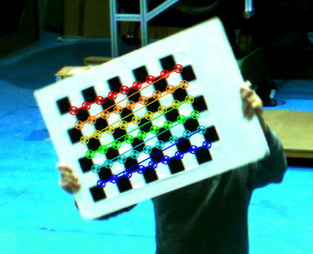
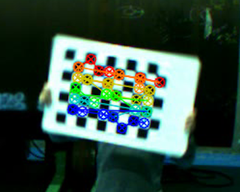
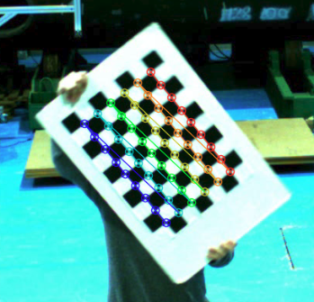
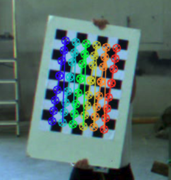

# User & Programmers Manual

This module is integrated in OPIL, so the people detected will be added to the virtual representation of the environment through the FIROS bridge. 

To send the information about the position of the operators we are using the `FIROS` module. We have done this because the type of message we need in our application has already been defined and implemented in the `Central Sensing and Perception`. 

We are using the same type of messages that are used to indicate the position of the robots within the map (check the definition [here](https://github.com/ramp-eu/Local_Sensing_and_Perception/blob/4fb4894a63e3a4bb5ec3712fad6c646a3013de3a/src/mapupdates/msg/NewObstacles.msg)). The name of the new topic is `/worker/newObstacles`.

The weights of the `YOLO` neural network can be found [here](https://pjreddie.com/media/files/yolov3.weights).

# Person Detection And Tracking

## Docker

- `xhost +`
- `container_name=your_container_name`
- Check the `docker run` parameters acording to your setup (specially `net` to connect to your network and `FIWAREHOST` with the ip of the Orion instance).
- `docker run --rm -it --hostname $container_name  --name $container_name --privileged --net=finet --env ROS_MASTER_URI=http://127.0.0.1:11311 --env ROS_IP=127.0.0.1 --env FIWAREHOST=orion --env LOCALHOST=$container_name --gpus=all -e NVIDIA_DRIVER_CAPABILITIES=all --env="DISPLAY" --env="QT_X11_NO_MITSHM=1" --env="DEBIAN_FRONTEND=noninteractive" --volume="/tmp/.X11-unix:/tmp/.X11-unix:rw" docker.ramp.eu/betterfactory/person_detection_and_tracking:betterfactory bash`
- After exit the container do `xhost -`

## Scripts in /root directory

* `run_install.sh`: compiles catkin_ws inside docker container.
* `run_mono_recorder.sh`: records video or takes captures from one single camera.
* `run_intrinsic_calibration_1.sh`: generates calibration file for camera 1.
* `run_intrinsic_calibration_2.sh`: generates calibration file for camera 2.
* `run_stereo_recorder.sh`: records video or takes captures from two cameras at same time.
* `run_stereo_calibration.sh`: generates calibration file for the stereo system.
* `run_clean.sh`: removes all generated files for the calibration.
* `run_tracking.sh`: runs tracking system.

## Parameters

- Parameters in `/root/catkin_ws/install/share/stereo_camera_calibration/config/config.yaml`
- There are more parameters in the corresponding launch files.

## Intrinsic calibration process

For this step you need a chess patern to calibrate the cameras.

### Take pictures

- Open a console
- `docker start -i $container_name`
    - Run `#/root/run_mono_recorder.sh`
- Wait until the images are published.
- Keep it running

- Open another console
- `docker exec -it $container_name bash`
    - Take pictures for the *intrinsic calibration* for each camera with `#rosservice call /mono_camera_recorder_nodelet/take_capture`.
    - Move the chess patern smoothly in all directions and angles.
    - The results will be saved in the path pointed by the parameter `stereo_camera_calibration/record/images_path_1`.

### Intrinsic calibration

- Follow these steps with every camera of the tracking system
- Open a console
- `xhost +`
- `docker start -i $container_name`
    - Check parameters in launch file
    - Run `#/root/run_intrinsic_calibration_1.sh`, then `#/root/run_intrinsic_calibration_2.sh`
    - The input images will show up to check the calibration. Press enter to continue. Check if the circles are on the corners of the chess patern. If not, take the pictures again and repeat the process. 
    - A xml file will be generated with the intrinsic calibration parameters.
- After exit the container do `xhost -`

Good calibration | Bad calibration
--- | ---
 | 
 | 

## Stereo calibration process

For this step you need a chess patern to calibrate the cameras.

### Record stereo video

- Open a console.
- `docker start -i $container_name`
    - Run `#/root/run_stereo_recorder.sh`
- Wait until the images are published.
- Keep it running.

- Open another console
- `docker exec -it $container_name bash`
    - Record a video for the *stereo calibration* with `#rosservice call /stereo_camera_recorder_nodelet/start_video_recording`
    - Move the chess patern smoothly in several positions and angles.
    - Stop recording a video for the *stereo calibration* with `#rosservice call /stereo_camera_recorder_nodelet/stop_video_recording` 
    - The results will be saved in the files pointed by the parameters `stereo_camera_calibration/record/video_path_1` and `stereo_camera_calibration/record/video_path_2`

Chess patern movements for stereo calibration |
--- |
 |

### Stereo calibration

- Open a console.
- `xhost +`
- `docker start -i $container_name`
- Run `#/root/run_stereo_calibration.sh`
- Check the results in `/root/data/stereo/output/*.png`. If any of the pictures present an invalid calibration, record the stereo video again and repeat the process.
- After exit the container do `xhost -`

## Tracking

- Open a console.
- `xhost +`
- `docker start -i $container_name`
- Check parameters in `/root/catkin_ws/install/share/camera_tracker/config/config.yaml`
- Run `#/root/run_tracking.sh`
- Check the tracking is working properly.
- After stop the container do `xhost -`

Tracking |
--- |
 |